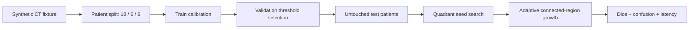

# Reproducible Stroke CT Segmentation Benchmark

**Measured synthetic baseline:** Dice `0.9425`, sensitivity `0.9048`, specificity `0.9998`, accuracy `0.9986`, and test confusion matrix `TN / FP / FN / TP = 218252 / 44 / 275 / 2613`.

**Proves:** a paper-inspired hemorrhagic-stroke CT segmentation workflow can enforce patient-level isolation, train-only calibration, validation-only threshold selection, untouched test evaluation, and immutable benchmark evidence in one offline Docker command.

> This is **not a clinical reproduction** of the paper's result. The original 25-exam dataset and Detectron2 weights are not public in this repository. The measured baseline uses deterministic synthetic CT phantoms and proves evaluation mechanics, not diagnostic performance.

## Evidence

| Measure | This repository | Published paper |
|---|---:|---:|
| Dice | `0.9425` synthetic | `0.9325 +/- 0.0389` clinical |
| Sensitivity | `0.9048` synthetic | `0.9982 +/- 0.0106` clinical |
| Specificity | `0.9998` synthetic | `0.9981 +/- 0.0009` clinical |
| Accuracy | `0.9986` synthetic | `0.9980 +/- 0.0009` clinical |
| Test unit | `6` patients / `24` slices | `100` hemorrhagic-stroke images reported |

The right column is attribution, not a result reproduced by this code. Pixel accuracy and specificity are high because lesion pixels are rare; Dice and sensitivity expose errors that accuracy hides.

## Run

```bash
docker build -t stroke-signal-demo .
docker run --rm --network none stroke-signal-demo
```

Canonical three-run evidence:

```powershell
./tools/benchmark.ps1
```

The default path uses no patient data, network, GPU, cloud, broker, database, or secret.

## Method



The workflow reconstructs two ideas described by Divisible Cell-Segmentation: recursive quadrant initialization and threshold-bounded region expansion. It does not implement the paper's Detectron2 R50-FPN detector or claim algorithmic equivalence.

## Boundaries

- `fixture.py` owns deterministic, non-clinical images and patient identity.
- `model.py` owns split policy, train calibration, validation selection, seed search, and segmentation.
- `domain.py` owns immutable split, confusion, metric, and result values.
- `benchmark.py` owns orchestration and evidence; `cli.py` owns transport only.
- No module imports a cloud SDK, framework server, database, broker, or another portfolio repository.

SRP is visible in those modules. DIP is unnecessary at the current boundary because no replaceable infrastructure exists. LSP is intentionally not claimed: there is no inheritance hierarchy to substitute. KISS and YAGNI keep the proof to one CPU pipeline instead of adding Detectron2, FastAPI, MLflow, Kafka, Kumo, or cloud resources that do not participate in this benchmark.

## Reproducibility

- Workload: `30` patients, `4` slices each, seed `2023`, patient split `18 / 6 / 6`.
- Runtime: pinned Python `3.12.13`, NumPy `2.5.1`, SciPy `1.18.0`, non-root container.
- Raw result: [`benchmarks/results/baseline.json`](benchmarks/results/baseline.json).
- V2 provenance: [`benchmarks/publication/stroke-signal-v2.json`](benchmarks/publication/stroke-signal-v2.json).
- Fixture contract: [`data/clinical-fixture-manifest.json`](data/clinical-fixture-manifest.json).

See [`REFERENCES.md`](REFERENCES.md) for the paper, thesis, dataset boundary, and library attribution.
