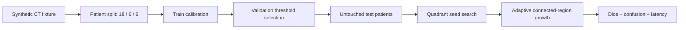

# Stroke CT Segmentation: Leakage-Safe Evaluation Benchmark

**Dice `0.9425`** on untouched test patients (sensitivity `0.9048`, specificity `0.9998`) from one offline Docker command. This is the public, reproducible companion to the IJCNN 2023 paper *Divisible Cell-Segmentation*, which I co-authored.

[](https://github.com/Brilhante29/stroke-signal-demo/actions/workflows/ci.yml)
[](LICENSE)


> This is **not a clinical reproduction** of the paper's result. The original 25-exam dataset and the Detectron2 weights cannot be redistributed, so the benchmark runs on deterministic synthetic CT phantoms. It proves the evaluation mechanics, not diagnostic performance.

## Why this exists

Medical-imaging numbers are easy to inflate by accident. Slices from one patient leak into both train and test, a threshold gets tuned on the test set, or pixel accuracy hides missed lesions because lesion pixels are rare. The paper reports Dice `0.9325 +/- 0.0389` on hemorrhagic-stroke CT. This repository turns the protocol behind that kind of claim into code anyone can run and audit:

- patients, not slices, are the split unit (`18 / 6 / 6`, zero overlap, checked in CI);
- calibration uses only training patients, and the threshold is chosen only on validation patients;
- the test patients are scored once, and Dice plus sensitivity are reported next to accuracy so imbalance cannot hide errors;
- every published number is regenerated from a pinned, network-isolated container.

## Results

| Measure | This repository (synthetic) | Published paper (clinical) |
|---|---:|---:|
| Dice | `0.9425` | `0.9325 +/- 0.0389` |
| Sensitivity | `0.9048` | `0.9982 +/- 0.0106` |
| Specificity | `0.9998` | `0.9981 +/- 0.0009` |
| Accuracy | `0.9986` | `0.9980 +/- 0.0009` |
| Test unit | `6` patients / `24` slices | `100` hemorrhagic-stroke images |

Test confusion matrix: `TN / FP / FN / TP = 218252 / 44 / 275 / 2613`.

The paper column is attribution, not a result reproduced by this code. Accuracy and specificity look excellent because lesion pixels are rare; Dice and sensitivity are the honest signals, and the `275` false-negative pixels are where this baseline loses.

## Quickstart

```bash
docker build -t stroke-signal-demo .
docker run --rm --network none stroke-signal-demo
```

The default path needs no patient data, network, GPU, cloud account, database, or secret.

Canonical three-run evidence (PowerShell 7):

```powershell
./tools/benchmark.ps1
```

Local development:

```bash
pip install -c constraints.lock -e ".[dev]"
pytest
```

## How it works



The workflow reconstructs two ideas from *Divisible Cell-Segmentation*: recursive quadrant initialization and threshold-bounded region growth. It does not implement the paper's Detectron2 R50-FPN detector and does not claim algorithmic equivalence.

| Module | Responsibility |
|---|---|
| `fixture.py` | Deterministic, non-clinical phantoms and patient identity |
| `model.py` | Split policy, train calibration, validation selection, seed search, segmentation |
| `domain.py` | Immutable split, confusion, metric, and result values |
| `benchmark.py` | Orchestration and evidence |
| `cli.py` | Transport only |

No module imports a cloud SDK, web framework, database, broker, or another repository.

## Design decisions

| Decision | Why | Rejected |
|---|---|---|
| Classical CPU pipeline | Runs anywhere, in seconds, with auditable steps | Detectron2 without the paper's data and weights would only reproduce the framework, not the result |
| Patient-level split with overlap check | Slice-level splits are the most common source of leakage in medical imaging | Random slice split |
| Dice and sensitivity as headline metrics | They expose missed lesion pixels that accuracy hides | Accuracy-first reporting |
| Synthetic phantoms | The clinical data requires agreements and cannot be published | Redistributing exams |
| CLI only | Nothing in the benchmark needs serving, tracking, or messaging | FastAPI, MLflow, Kafka, cloud resources |

## Limitations

- Synthetic phantoms with known geometry are easier than real CT. The Dice above is evidence of a correct protocol, not of clinical performance.
- No external validation. [PhysioNet CT-ICH](https://physionet.org/content/ct-ich/1.3.1/) is the planned candidate, but it requires a data-use agreement.
- Two-dimensional slices only, with no DICOM handling, reader study, or calibration analysis.

## Reproducibility

- Workload: `30` patients, `4` slices each, seed `2023`, patient split `18 / 6 / 6`.
- Runtime: Python `3.12`, NumPy `2.5.1`, SciPy `1.18.0`, non-root container pinned by digest.
- Raw result: [`benchmarks/results/baseline.json`](benchmarks/results/baseline.json).
- V2 provenance (source commit, image digest, lock digest): [`benchmarks/publication/stroke-signal-v2.json`](benchmarks/publication/stroke-signal-v2.json).
- Fixture contract: [`data/clinical-fixture-manifest.json`](data/clinical-fixture-manifest.json).

## Project structure

```text
src/stroke_signal/   fixture, model, domain, benchmark, CLI
tests/               21 unit and contract tests (97% line coverage)
benchmarks/          workload, raw results, V2 publication evidence
contracts/           JSON Schema of the medical evaluation report
data/                synthetic fixture manifest and license
tools/               three-run benchmark, evidence builder, validators
sdd/  openspec/      specification, architecture and technical decisions
```

## How this repository is built

The project follows the spec-driven workflow of [portfolio-reuse-kit](https://github.com/Brilhante29/portfolio-reuse-kit). Requirements and decisions live in [`sdd/`](sdd) and [`openspec/`](openspec), and [`project.yaml`](project.yaml) records the architecture, stack, and rejected alternatives. Development is AI-assisted and human-governed: [`AGENTS.md`](AGENTS.md) and [`CLAUDE.md`](CLAUDE.md) hold the coding-agent instructions, while tests, validators, and CI decide what gets published.

## Research context

- Paper: [Divisible Cell-Segmentation: A New Approach for Stroke Detection and Segmentation in CT Scans Using Deep Learning and Fine-tuning](https://doi.org/10.1109/IJCNN54540.2023.10191320), IEEE IJCNN 2023.
- Related: [Wearable Stroke Alert System](https://doi.org/10.1109/SBESC65055.2024.10771817), IEEE SBESC 2024.
- Sibling repositories: [melanoma-classifier](https://github.com/Brilhante29/melanoma-classifier) (dermatoscopy evaluation) and [yolo-training-pipeline](https://github.com/Brilhante29/yolo-training-pipeline) (detector training path).

See [`REFERENCES.md`](REFERENCES.md) for the paper, thesis, dataset boundary, and library attribution.

## Author

**Guilherme Brilhante**, software engineer working on scalable backends and production AI.
[LinkedIn](https://www.linkedin.com/in/guilhermefreirebrilhanteseveriano/) · [GitHub](https://github.com/Brilhante29) · [Publications](https://dblp.org/pid/353/6812.html)

## License

[MIT](LICENSE). The synthetic fixture contains no DICOM file, patient record, or image copied from the paper or another dataset.
